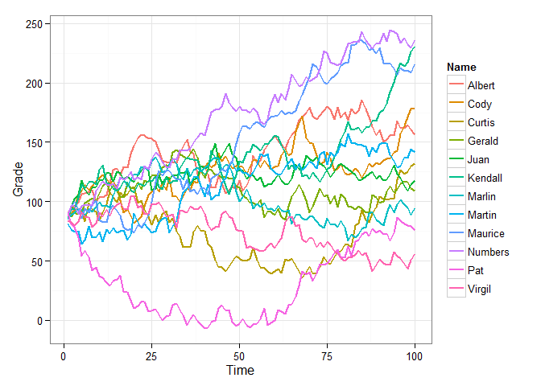
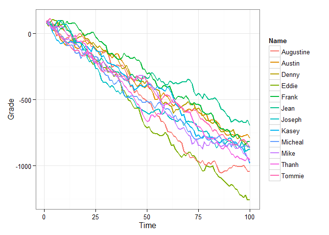
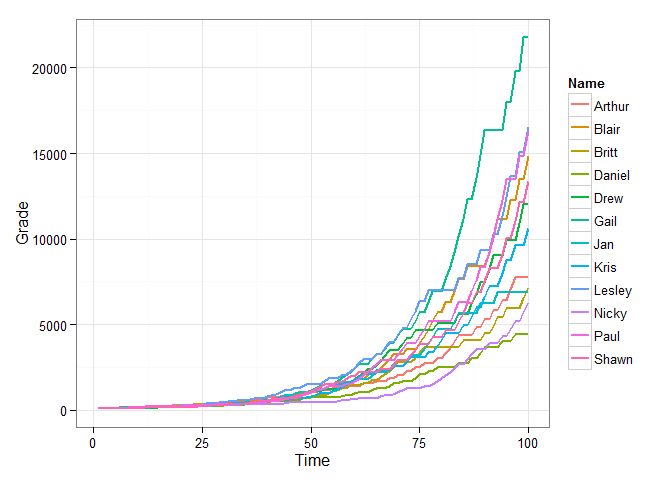

-   relate Argument
-   Adjust Correlations
-   Visualize the relationship:
    -   Example 1
    -   Exmple 2
    -   Exmple 3
    -   Exmple 4

Ulf suggested related data sets in this comment: <http://goo.gl/H1RKsV>.
I have added the `relate` function as well as a `relate` argument to
`r_series` in version 0.2.0 of **wakefield**. Here is a demonstration of
some of the capabilities:

First install the newst version of **wakefield**:

    if (!require("pacman")) install.packages("pacman"); library(pacman)
    p_install_gh("trinker/wakefield")
    p_load(dplyr, wakefield, tidyr, ggplot2)

relate Argument
===============

The `relate` has been added to `r_series`. It allows the user to specify
the relationship between columns. May be be a named list of or a short
hand string of the form of `"fM_sd"` where:

-   `f` is one of (+, -, \*, /)
-   `M` is a mean value
-   `sd` is a standard deviation of the mean value

For example you may use `relate = "*4_1"`. If `relate = NULL` no
relationship is generated between columns. I will use the short hand
string form here.

Adjust Correlations
===================

Use the `sd` command to adjust correlations.

    round(cor(r_series(grade, 8, 10, relate = "+1_2")), 2)

    ##         Grade_1 Grade_2 Grade_3 Grade_4 Grade_5 Grade_6 Grade_7 Grade_8
    ## Grade_1    1.00    0.94    0.69    0.78    0.82    0.85    0.79    0.76
    ## Grade_2    0.94    1.00    0.83    0.92    0.93    0.93    0.89    0.85
    ## Grade_3    0.69    0.83    1.00    0.96    0.92    0.92    0.89    0.85
    ## Grade_4    0.78    0.92    0.96    1.00    0.97    0.95    0.95    0.91
    ## Grade_5    0.82    0.93    0.92    0.97    1.00    0.98    0.94    0.89
    ## Grade_6    0.85    0.93    0.92    0.95    0.98    1.00    0.97    0.93
    ## Grade_7    0.79    0.89    0.89    0.95    0.94    0.97    1.00    0.99
    ## Grade_8    0.76    0.85    0.85    0.91    0.89    0.93    0.99    1.00

    round(cor(r_series(grade, 8, 10, relate = "+1_0")), 2)

    ##         Grade_1 Grade_2 Grade_3 Grade_4 Grade_5 Grade_6 Grade_7 Grade_8
    ## Grade_1       1       1       1       1       1       1       1       1
    ## Grade_2       1       1       1       1       1       1       1       1
    ## Grade_3       1       1       1       1       1       1       1       1
    ## Grade_4       1       1       1       1       1       1       1       1
    ## Grade_5       1       1       1       1       1       1       1       1
    ## Grade_6       1       1       1       1       1       1       1       1
    ## Grade_7       1       1       1       1       1       1       1       1
    ## Grade_8       1       1       1       1       1       1       1       1

    round(cor(r_series(grade, 8, 10, relate = "+1_20")), 2)

    ##         Grade_1 Grade_2 Grade_3 Grade_4 Grade_5 Grade_6 Grade_7 Grade_8
    ## Grade_1    1.00    0.25   -0.08    0.02   -0.08   -0.23   -0.24   -0.34
    ## Grade_2    0.25    1.00    0.76    0.72    0.50    0.36    0.31    0.30
    ## Grade_3   -0.08    0.76    1.00    0.75    0.54    0.46    0.51    0.38
    ## Grade_4    0.02    0.72    0.75    1.00    0.76    0.58    0.58    0.41
    ## Grade_5   -0.08    0.50    0.54    0.76    1.00    0.83    0.72    0.62
    ## Grade_6   -0.23    0.36    0.46    0.58    0.83    1.00    0.89    0.82
    ## Grade_7   -0.24    0.31    0.51    0.58    0.72    0.89    1.00    0.91
    ## Grade_8   -0.34    0.30    0.38    0.41    0.62    0.82    0.91    1.00

    round(cor(r_series(grade, 8, 10, relate = "+15_20")), 2)

    ##         Grade_1 Grade_2 Grade_3 Grade_4 Grade_5 Grade_6 Grade_7 Grade_8
    ## Grade_1    1.00    0.27    0.06    0.15    0.09   -0.18   -0.32   -0.36
    ## Grade_2    0.27    1.00    0.71    0.75    0.77    0.41    0.23    0.34
    ## Grade_3    0.06    0.71    1.00    0.81    0.75    0.57    0.39    0.49
    ## Grade_4    0.15    0.75    0.81    1.00    0.98    0.74    0.65    0.58
    ## Grade_5    0.09    0.77    0.75    0.98    1.00    0.81    0.71    0.64
    ## Grade_6   -0.18    0.41    0.57    0.74    0.81    1.00    0.92    0.88
    ## Grade_7   -0.32    0.23    0.39    0.65    0.71    0.92    1.00    0.87
    ## Grade_8   -0.36    0.34    0.49    0.58    0.64    0.88    0.87    1.00

Visualize the relationship:
===========================

Example 1
---------

    dat <- r_data_frame(12,
        name,
        r_series(grade, 100, relate = "+1_6")
    ) 

    dat %>%
        gather(Time, Grade, -c(Name)) %>%
        mutate(Time = as.numeric(gsub("\\D", "", Time))) %>%
        ggplot(aes(x = Time, y = Grade, color = Name, group = Name)) +
            geom_line(size=.8) + 
            theme_bw()

Exmple 2
--------

    dat <- r_data_frame(12,
        name,
        r_series(grade, 100, relate = "-10_20")
    ) 

    dat %>%
        gather(Time, Grade, -c(Name)) %>%
        mutate(Time = as.numeric(gsub("\\D", "", Time))) %>%
        ggplot(aes(x = Time, y = Grade, color = Name, group = Name)) +
            geom_line(size=.8) + 
            theme_bw()

Exmple 3
--------

    dat <- r_data_frame(12,
        name,
        r_series(grade, 100, relate = "*1.05_.01")
    ) 

    dat %>%
        gather(Time, Grade, -c(Name)) %>%
        mutate(Time = as.numeric(gsub("\\D", "", Time))) %>%
        ggplot(aes(x = Time, y = Grade, color = Name, group = Name)) +
            geom_line(size=.8) + 
            theme_bw()

Exmple 4
--------

    dat <- r_data_frame(12,
        name,
        r_series(grade, 100, relate = "/1.5_.5")
    ) 

    dat %>%
        gather(Time, Grade, -c(Name)) %>%
        mutate(Time = as.numeric(gsub("\\D", "", Time))) %>%
        ggplot(aes(x = Time, y = Grade, color = Name, group = Name)) +
            geom_line(size=.8) + 
            theme_bw()

