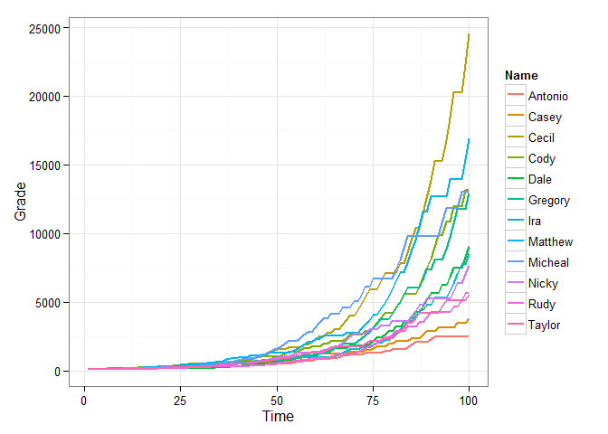

Ulf suggested related data sets in this comment: <http://goo.gl/H1RKsV>. I have added the `relate` function as well as a `relate` argument to `r_series` in version 0.2.0 of **wakefield**. Here is a demonstration of some of the capabilities:

First install the newst version of **wakefield**:

``` r
if (!require("pacman")) install.packages("pacman"); library(pacman)
p_install_gh("trinker/wakefield")
p_load(dplyr, wakefield, tidyr, ggplot2)
```

relate Argument
===============

The `relate` has been added to `r_series`. It allows the user to specify the relationship between columns. May be be a named list of or a short hand string of the form of `"fM_sd"` where:

-   `f` is one of (+, -, \*, /)
-   `M` is a mean value
-   `sd` is a standard deviation of the mean value

For example you may use `relate = "*4_1"`. If `relate = NULL` no relationship is generated between columns. I will use the short hand string form here.

Some Examples With Variation
============================

``` r
r_series(grade, j = 5, n = 100, relate = "+1_6")
```

    ## Source: local data frame [100 x 5]
    ## 
    ##    Grade_1 Grade_2 Grade_3 Grade_4 Grade_5
    ## 1     86.6    91.1    93.2    88.9    89.5
    ## 2     87.5    90.0   100.8    98.0   111.2
    ## 3     93.6    94.6   107.9   113.8   110.3
    ## 4     90.6    93.9    93.5    99.3    96.9
    ## 5     94.3    94.4    94.0    86.0    85.5
    ## 6     85.5    79.5    87.2    94.5    92.1
    ## 7     89.6    90.2   101.3   104.0   101.4
    ## 8     91.3    76.9    89.5    88.2    76.9
    ## 9     89.3    81.5    75.8    76.1    82.8
    ## 10    89.4    86.1    80.7    78.6    84.8
    ## ..     ...     ...     ...     ...     ...

``` r
r_series(age, 5, 100, relate = "+5_0")
```

    ## Source: local data frame [100 x 5]
    ## 
    ##    Age_1 Age_2 Age_3 Age_4 Age_5
    ## 1     26    31    36    41    46
    ## 2     28    33    38    43    48
    ## 3     27    32    37    42    47
    ## 4     35    40    45    50    55
    ## 5     32    37    42    47    52
    ## 6     25    30    35    40    45
    ## 7     22    27    32    37    42
    ## 8     25    30    35    40    45
    ## 9     24    29    34    39    44
    ## 10    32    37    42    47    52
    ## ..   ...   ...   ...   ...   ...

``` r
r_series(likert, 5,  100, name ="Item", relate = "-.5_.1")
```

    ## Source: local data frame [100 x 5]
    ## 
    ##    Item_1 Item_2 Item_3 Item_4 Item_5
    ## 1       1      0      0     -1     -1
    ## 2       3      2      2      1      0
    ## 3       4      4      4      3      3
    ## 4       1      0      0     -1     -1
    ## 5       3      3      3      2      1
    ## 6       4      4      3      2      1
    ## 7       3      2      2      2      1
    ## 8       1      0      0     -1     -1
    ## 9       5      5      4      4      3
    ## 10      1      0      0     -1     -2
    ## ..    ...    ...    ...    ...    ...

``` r
r_series(grade, j = 5, n = 100, relate = "*1.05_.1")
```

    ## Source: local data frame [100 x 5]
    ## 
    ##    Grade_1 Grade_2 Grade_3  Grade_4  Grade_5
    ## 1     79.9   95.88 105.468 116.0148 127.6163
    ## 2     81.8  106.34 106.340 127.6080 127.6080
    ## 3     94.0   84.60  84.600  84.6000  84.6000
    ## 4     81.9   81.90  65.520  65.5200  72.0720
    ## 5     89.9  116.87 128.557 167.1241 150.4117
    ## 6     80.7   88.77  79.893  79.8930  87.8823
    ## 7     79.4   71.46  64.314  77.1768  77.1768
    ## 8     81.0   89.10  89.100 106.9200 128.3040
    ## 9     80.6   80.60  96.720  96.7200  96.7200
    ## 10    92.3  119.99 143.988 129.5892 129.5892
    ## ..     ...     ...     ...      ...      ...

Adjust Correlations
===================

Use the `sd` command to adjust correlations.

``` r
round(cor(r_series(grade, 8, 10, relate = "+1_2")), 2)
```

    ##         Grade_1 Grade_2 Grade_3 Grade_4 Grade_5 Grade_6 Grade_7 Grade_8
    ## Grade_1    1.00    0.93    0.82    0.82    0.74    0.74    0.68    0.67
    ## Grade_2    0.93    1.00    0.91    0.90    0.81    0.80    0.73    0.77
    ## Grade_3    0.82    0.91    1.00    0.96    0.95    0.94    0.86    0.86
    ## Grade_4    0.82    0.90    0.96    1.00    0.92    0.93    0.85    0.86
    ## Grade_5    0.74    0.81    0.95    0.92    1.00    0.99    0.95    0.92
    ## Grade_6    0.74    0.80    0.94    0.93    0.99    1.00    0.95    0.92
    ## Grade_7    0.68    0.73    0.86    0.85    0.95    0.95    1.00    0.98
    ## Grade_8    0.67    0.77    0.86    0.86    0.92    0.92    0.98    1.00

``` r
round(cor(r_series(grade, 8, 10, relate = "+1_0")), 2)
```

    ##         Grade_1 Grade_2 Grade_3 Grade_4 Grade_5 Grade_6 Grade_7 Grade_8
    ## Grade_1       1       1       1       1       1       1       1       1
    ## Grade_2       1       1       1       1       1       1       1       1
    ## Grade_3       1       1       1       1       1       1       1       1
    ## Grade_4       1       1       1       1       1       1       1       1
    ## Grade_5       1       1       1       1       1       1       1       1
    ## Grade_6       1       1       1       1       1       1       1       1
    ## Grade_7       1       1       1       1       1       1       1       1
    ## Grade_8       1       1       1       1       1       1       1       1

``` r
round(cor(r_series(grade, 8, 10, relate = "+1_20")), 2)
```

    ##         Grade_1 Grade_2 Grade_3 Grade_4 Grade_5 Grade_6 Grade_7 Grade_8
    ## Grade_1    1.00    0.11   -0.20   -0.38   -0.59   -0.59   -0.48   -0.28
    ## Grade_2    0.11    1.00    0.90    0.78    0.63    0.47    0.52    0.50
    ## Grade_3   -0.20    0.90    1.00    0.92    0.84    0.78    0.76    0.66
    ## Grade_4   -0.38    0.78    0.92    1.00    0.94    0.83    0.85    0.77
    ## Grade_5   -0.59    0.63    0.84    0.94    1.00    0.89    0.91    0.75
    ## Grade_6   -0.59    0.47    0.78    0.83    0.89    1.00    0.89    0.77
    ## Grade_7   -0.48    0.52    0.76    0.85    0.91    0.89    1.00    0.86
    ## Grade_8   -0.28    0.50    0.66    0.77    0.75    0.77    0.86    1.00

``` r
round(cor(r_series(grade, 8, 10, relate = "+15_20")), 2)
```

    ##         Grade_1 Grade_2 Grade_3 Grade_4 Grade_5 Grade_6 Grade_7 Grade_8
    ## Grade_1    1.00    0.57    0.82    0.74    0.77    0.76    0.77    0.79
    ## Grade_2    0.57    1.00    0.78    0.79    0.67    0.58    0.33    0.52
    ## Grade_3    0.82    0.78    1.00    0.92    0.90    0.70    0.56    0.66
    ## Grade_4    0.74    0.79    0.92    1.00    0.84    0.59    0.39    0.49
    ## Grade_5    0.77    0.67    0.90    0.84    1.00    0.81    0.59    0.64
    ## Grade_6    0.76    0.58    0.70    0.59    0.81    1.00    0.86    0.86
    ## Grade_7    0.77    0.33    0.56    0.39    0.59    0.86    1.00    0.93
    ## Grade_8    0.79    0.52    0.66    0.49    0.64    0.86    0.93    1.00

Visualize the relationship:
===========================

Example 1
---------

``` r
dat <- r_data_frame(12,
    name,
    r_series(grade, 100, relate = "+1_6")
) 

dat %>%
    gather(Time, Grade, -c(Name)) %>%
    mutate(Time = as.numeric(gsub("\\D", "", Time))) %>%
    ggplot(aes(x = Time, y = Grade, color = Name, group = Name)) +
        geom_line(size=.8) + 
        theme_bw()
```


Exmple 2
--------

``` r
dat <- r_data_frame(12,
    name,
    r_series(grade, 100, relate = "-10_20")
) 

dat %>%
    gather(Time, Grade, -c(Name)) %>%
    mutate(Time = as.numeric(gsub("\\D", "", Time))) %>%
    ggplot(aes(x = Time, y = Grade, color = Name, group = Name)) +
        geom_line(size=.8) + 
        theme_bw()
```


Exmple 3
--------

``` r
dat <- r_data_frame(12,
    name,
    r_series(grade, 100, relate = "*1.05_.01")
) 

dat %>%
    gather(Time, Grade, -c(Name)) %>%
    mutate(Time = as.numeric(gsub("\\D", "", Time))) %>%
    ggplot(aes(x = Time, y = Grade, color = Name, group = Name)) +
        geom_line(size=.8) + 
        theme_bw()
```



Exmple 4
--------

``` r
dat <- r_data_frame(12,
    name,
    r_series(grade, 100, relate = "/1.5_.5")
) 

dat %>%
    gather(Time, Grade, -c(Name)) %>%
    mutate(Time = as.numeric(gsub("\\D", "", Time))) %>%
    ggplot(aes(x = Time, y = Grade, color = Name, group = Name)) +
        geom_line(size=.8) + 
        theme_bw()
```


