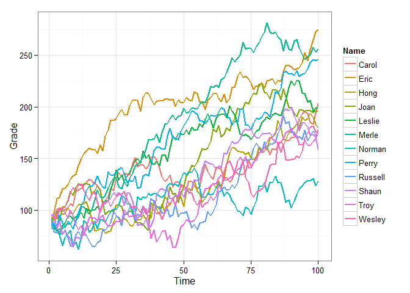

Ulf suggested related data sets in this comment: <http://goo.gl/H1RKsV>. I have added the `relate` function as well as a `relate` argument to `r_series` in version 0.2.0 of **wakefield**. Here is a demonstration of some of the capabilities:

First install the newst version of **wakefield**:

``` r
if (!require("pacman")) install.packages("pacman"); library(pacman)
p_install_gh("trinker/wakefield")
p_load(dplyr, wakefield, tidyr, ggplot2)
```

relate Argument
===============

The `relate` has been added to `r_series`. It allows the user to specify the relationship between columns. May be be a named list of or a short hand string of the form of `"fM_sd"` where:

-   `f` is one of (+, -, \*, /)
-   `M` is a mean value
-   `sd` is a standard deviation of the mean value

For example you may use `relate = "*4_1"`. If `relate = NULL` no relationship is generated between columns. I will use the short hand string form here.

Adjust Correlations
===================

Use the `sd` command to adjust correlations.

``` r
round(cor(r_series(grade, 8, 10, relate = "+1_2")), 2)
```

    ##         Grade_1 Grade_2 Grade_3 Grade_4 Grade_5 Grade_6 Grade_7 Grade_8
    ## Grade_1    1.00    0.96    0.87    0.73    0.48    0.66    0.57    0.49
    ## Grade_2    0.96    1.00    0.96    0.83    0.64    0.81    0.75    0.64
    ## Grade_3    0.87    0.96    1.00    0.95    0.81    0.89    0.84    0.68
    ## Grade_4    0.73    0.83    0.95    1.00    0.89    0.87    0.79    0.58
    ## Grade_5    0.48    0.64    0.81    0.89    1.00    0.90    0.87    0.64
    ## Grade_6    0.66    0.81    0.89    0.87    0.90    1.00    0.91    0.73
    ## Grade_7    0.57    0.75    0.84    0.79    0.87    0.91    1.00    0.87
    ## Grade_8    0.49    0.64    0.68    0.58    0.64    0.73    0.87    1.00

``` r
round(cor(r_series(grade, 8, 10, relate = "+1_0")), 2)
```

    ##         Grade_1 Grade_2 Grade_3 Grade_4 Grade_5 Grade_6 Grade_7 Grade_8
    ## Grade_1       1       1       1       1       1       1       1       1
    ## Grade_2       1       1       1       1       1       1       1       1
    ## Grade_3       1       1       1       1       1       1       1       1
    ## Grade_4       1       1       1       1       1       1       1       1
    ## Grade_5       1       1       1       1       1       1       1       1
    ## Grade_6       1       1       1       1       1       1       1       1
    ## Grade_7       1       1       1       1       1       1       1       1
    ## Grade_8       1       1       1       1       1       1       1       1

``` r
round(cor(r_series(grade, 8, 10, relate = "+1_20")), 2)
```

    ##         Grade_1 Grade_2 Grade_3 Grade_4 Grade_5 Grade_6 Grade_7 Grade_8
    ## Grade_1    1.00   -0.20   -0.60   -0.71   -0.60   -0.34   -0.19   -0.14
    ## Grade_2   -0.20    1.00    0.87    0.72    0.61    0.57    0.49    0.49
    ## Grade_3   -0.60    0.87    1.00    0.90    0.69    0.54    0.37    0.37
    ## Grade_4   -0.71    0.72    0.90    1.00    0.77    0.63    0.49    0.52
    ## Grade_5   -0.60    0.61    0.69    0.77    1.00    0.93    0.83    0.81
    ## Grade_6   -0.34    0.57    0.54    0.63    0.93    1.00    0.94    0.95
    ## Grade_7   -0.19    0.49    0.37    0.49    0.83    0.94    1.00    0.98
    ## Grade_8   -0.14    0.49    0.37    0.52    0.81    0.95    0.98    1.00

``` r
round(cor(r_series(grade, 8, 10, relate = "+15_20")), 2)
```

    ##         Grade_1 Grade_2 Grade_3 Grade_4 Grade_5 Grade_6 Grade_7 Grade_8
    ## Grade_1    1.00    0.37    0.13    0.09    0.17   -0.12    0.03    0.16
    ## Grade_2    0.37    1.00    0.86    0.37    0.21    0.33    0.34    0.49
    ## Grade_3    0.13    0.86    1.00    0.58    0.35    0.45    0.57    0.68
    ## Grade_4    0.09    0.37    0.58    1.00    0.84    0.62    0.69    0.63
    ## Grade_5    0.17    0.21    0.35    0.84    1.00    0.82    0.84    0.64
    ## Grade_6   -0.12    0.33    0.45    0.62    0.82    1.00    0.89    0.65
    ## Grade_7    0.03    0.34    0.57    0.69    0.84    0.89    1.00    0.87
    ## Grade_8    0.16    0.49    0.68    0.63    0.64    0.65    0.87    1.00

Visualize the relationship:
===========================

Example 1
---------

``` r
dat <- r_data_frame(12,
    name,
    r_series(grade, 100, relate = "+1_6")
) 

dat %>%
    gather(Time, Grade, -c(Name)) %>%
    mutate(Time = as.numeric(gsub("\\D", "", Time))) %>%
    ggplot(aes(x = Time, y = Grade, color = Name, group = Name)) +
        geom_line(size=.8) + 
        theme_bw()
```


Exmple 2
--------

``` r
dat <- r_data_frame(12,
    name,
    r_series(grade, 100, relate = "-10_20")
) 

dat %>%
    gather(Time, Grade, -c(Name)) %>%
    mutate(Time = as.numeric(gsub("\\D", "", Time))) %>%
    ggplot(aes(x = Time, y = Grade, color = Name, group = Name)) +
        geom_line(size=.8) + 
        theme_bw()
```



Exmple 3
--------

``` r
dat <- r_data_frame(12,
    name,
    r_series(grade, 100, relate = "*1.05_.01")
) 

dat %>%
    gather(Time, Grade, -c(Name)) %>%
    mutate(Time = as.numeric(gsub("\\D", "", Time))) %>%
    ggplot(aes(x = Time, y = Grade, color = Name, group = Name)) +
        geom_line(size=.8) + 
        theme_bw()
```


Exmple 4
--------

``` r
dat <- r_data_frame(12,
    name,
    r_series(grade, 100, relate = "/1.5_.5")
) 

dat %>%
    gather(Time, Grade, -c(Name)) %>%
    mutate(Time = as.numeric(gsub("\\D", "", Time))) %>%
    ggplot(aes(x = Time, y = Grade, color = Name, group = Name)) +
        geom_line(size=.8) + 
        theme_bw()
```


